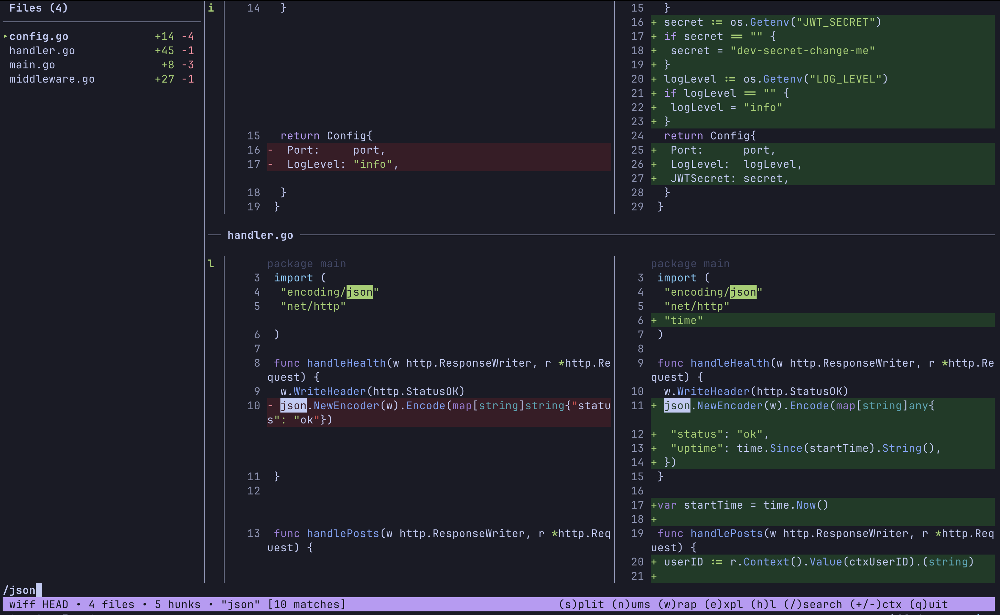

# wiff: watch diff

A terminal diff viewer with syntax highlighting, side-by-side mode, live updates, and hunk navigation.



## Install

```
go install github.com/h0rv/wiff@latest
```

See [INSTALL.md](INSTALL.md) for more options (Homebrew, pre-built binaries, shell script).

## Usage

```
wiff              # unstaged changes
wiff HEAD         # diff against HEAD
wiff HEAD~3       # diff against 3 commits ago
wiff HEAD~3..HEAD # diff a commit range
wiff main feature # diff between branches
wiff --staged     # staged changes
wiff -s           # side-by-side mode
git diff | wiff   # pipe any diff
```

## Flags

```
-s             Side-by-side mode
-e             Open file explorer
-N             Disable line numbers
-W             Disable line wrapping
-B             Disable diff background tints
-S             Disable syntax highlighting
-U<n>          Context lines (default 3)
-t <name>      Color theme (default: monokai, env: WIFF_THEME)
--staged       Show staged changes
--cached       Show staged changes (alias)
--themes       List available themes
-v, --version  Show version
-h, --help     Show help
```

## Themes

wiff supports 70+ syntax highlighting themes via [chroma](https://github.com/alecthomas/chroma).

```
wiff --themes         # list all available themes
wiff -t dracula       # use a specific theme
WIFF_THEME=nord wiff  # set via environment variable
```

## Keys

```
j/k         Scroll                s   Side-by-side
d/u         Half page             n   Line numbers
g/G         Top/bottom            w   Wrap
Tab         Next file             e   File explorer
S-Tab       Prev file             h   Syntax highlight
]c/[c       Next/prev hunk        b   Diff background
]f/[f       Next/prev file        f   Full file view
+/-         Context lines         W   Watch mode
y+label     Yank added lines      F   Follow mode
Y+label     Yank removed lines    o   Open in $EDITOR
p+label     Yank patch            /   Search
c+label     Copy result (new)     ?   Help
A+label     Stage/unstage hunk
```

Mouse scroll, tree click, double-click to copy chunk, and right-click to copy chunk are supported.

## License

[MIT](LICENSE)
